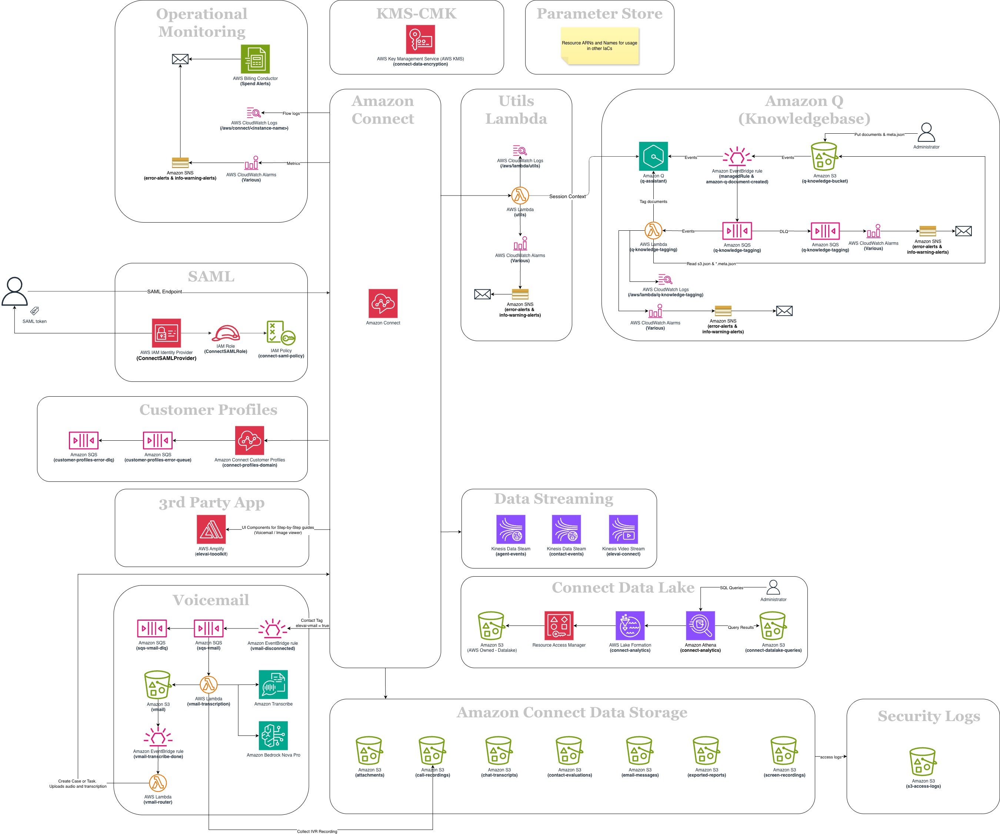

# Elevai Connect

Production-ready Amazon Connect infrastructure as code.

[](https://opensource.org/licenses/Apache-2.0)
[](https://www.pulumi.com/)
[](https://www.python.org/)


Deploy a complete Amazon Connect contact center in minutes. Monitoring, security, AI assistance, voicemail, and business admin tools — all pre-configured and ready to go.

**[Website](https://www.elevai.cx)** · **[Documentation](https://elevai-cx.github.io/elevai-connect/)** · **[Getting Started](docs/GETTING_STARTED.md)**



## Why Elevai Connect?

Setting up Amazon Connect properly means wiring together S3, DynamoDB, Lambda, CloudWatch, IAM, Secrets Manager, and more. Most teams spend weeks doing this from scratch, piecing together examples from docs and blog posts.

Elevai Connect gives you all of that in a single `pulumi up`. One command, one config file, and you have a production contact center with 70+ monitoring alarms, encryption, audit logging, and SAML SSO already in place.

## What's included

| Feature | |
|---|---|
| Amazon Connect instance | ✅ |
| Amazon Q (AI agent assistance) | ✅ |
| Customer Profiles | ✅ |
| Cases | ✅ |
| Storage (recordings, transcripts, reports, attachments, screen recordings, evaluations, email, live media) | ✅ |
| Data streaming (agent trace, contact records) | ✅ |
| Data lake with Athena (27 analytics tables) | ✅ |
| Forecasting, capacity planning & scheduling | ✅ |
| Approved origins | ✅ |
| 70+ CloudWatch monitoring alarms | ✅ |
| SAML 2.0 SSO authentication | ✅ |
| KMS encryption at rest | ✅ |
| Business User Interface (admin workspaces, data tables, views) | ✅ |
| Voicemail (transcription, case/task routing) | ✅ |

## Quick start

```bash
git clone https://github.com/elevai-cx/elevai-connect.git
cd elevai-connect
python -m venv venv && source venv/bin/activate
pip install -r requirements.txt
pulumi stack init dev
cp Pulumi.dev.yaml.example Pulumi.dev.yaml
# Edit Pulumi.dev.yaml with your settings
pulumi up
```

See the full [Getting Started guide](docs/GETTING_STARTED.md) for a step-by-step walkthrough.

## Who is this for?

**Small to medium businesses** — Launch a professional contact center without a large DevOps team. Budget alerts and cost monitoring are built in.

**AWS partners & consultants** — Ship client projects faster with a production-ready foundation you can customise per engagement.

**Startups** — Focus on customers, not infrastructure. Production-grade from day one.

**Platform teams** — Version controlled, repeatable, auditable. Modular architecture keeps core and custom resources separate.

## Extending

The `custom/` directory is yours. Add organisation-specific resources without conflicting with core updates:

- [Custom Extensions Guide](docs/CUSTOM_EXTENSIONS_GUIDE.md) — Add Lambda functions, DynamoDB tables, API Gateways via Pulumi
- [Parameter Store Guide](docs/PARAMETER_STORE_GUIDE.md) — Export resource ARNs for use with any external IaC or system

## Security

Compliance-checked against CIS AWS Foundations Benchmark, PCI DSS v4.0.1, and AWS Foundational Security Best Practices. Encryption at rest, least-privilege IAM, audit logging, and configurable data retention are all configured out of the box.

See [SECURITY.md](SECURITY.md) for vulnerability reporting.

## Documentation

Full documentation is available at **[elevai-cx.github.io/elevai-connect](https://elevai-cx.github.io/elevai-connect/)**.

Guides cover [getting started](docs/GETTING_STARTED.md), [SAML setup](docs/SAML_SETUP_GUIDE.md), [Amazon Q](docs/AMAZON_Q_GUIDE.md), [BUI](docs/BUI_GUIDE.md), [analytics](docs/ANALYTICS_DATA_LAKE.md), [monitoring](docs/MONITORING_GUIDE.md), [custom extensions](docs/CUSTOM_EXTENSIONS_GUIDE.md), and [parameter store integration](docs/PARAMETER_STORE_GUIDE.md).

## Community

- [GitHub Issues](https://github.com/elevai-cx/elevai-connect/issues) — Bug reports and feature requests
- [GitHub Discussions](https://github.com/elevai-cx/elevai-connect/discussions) — Questions and ideas
- [Contributing Guide](CONTRIBUTING.md) — How to contribute

## License

Apache License 2.0 — see [LICENSE](LICENSE) for details.

Copyright (c) 2025 Elevai Limited
